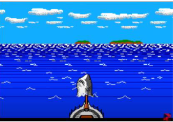
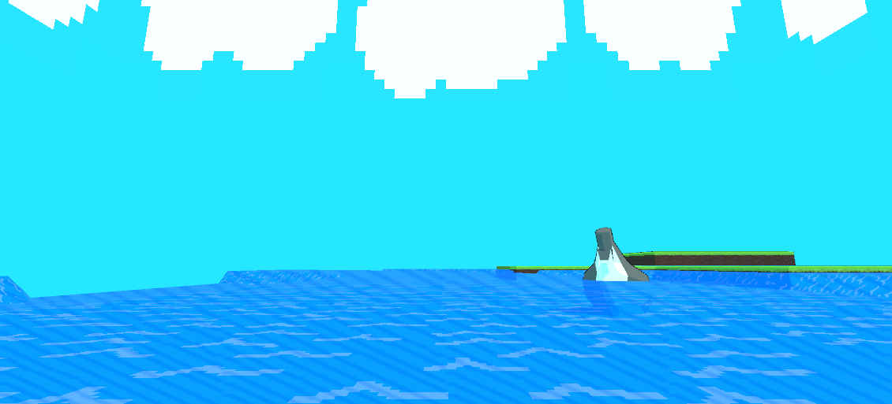

# Assignment 2 In Class Albert Tran
 Assignment 2 in class activity for Internediate Computer Graphics 


# Deffered and Forward rendering: What's the difference and implementation

Within the field of Computer Graphics there are typically two different kinds of rendering pipelines we can use Forward Rendering and Deffered Rendering.

Forward rendering consists of 4 main parts, The base geometry of a shape, the vertex shader, the geometry shader, and the fragment shader. Essentially this is the basic rendering technique most engines use, the vertex shader providing vertex information and transformations such as rotation, translation, or scaling, The Geometry shader can then take this information and change the geometry of the object itself, as the name implies. Finally the fragment shader adds color and lighting to the object, and creates a basic object for use.

The pipeline for this may look like the following:


Deferred Rendering on the other hand uses the same steps as Forward Rendering, going from Vertex to Geometry, and then to Fragment. However it is changed a bit, instead of simplely going through all of the shaders, it instead defers the the shaders until the pipeline has gone through everything. It then also handles the lighting and other shading information by applying it at the end, instead of at the fragment shader. 

The pipeline for this may look like the following:


The reason why you may want to use Deffered Rendering over Forward Rendering may be for a few reasons. The main reason why is that with Forward rendering, since the fragment shader takes in your geometry and vertex information, it can only apply lighting on a per vertex basis, which can result in very intensive calculations if your object has a lot of vertices. Since deffered rendering splits this process, you end not having to do as many calculations, which results in less intensitivity for your object. 

A Flowchart for both pipelines may look like the following:


# Scene Recreation: Sqaure Waves with Toon Shading

For my code I have written in this assignment, I was provided a picture of the following scene and began recreation based on the assignment details:



In this part of the assignment we will create sqaure waves and apply toon shading to them:

In order to start with this shader, we first need to create a basic Toon Shading lighting model, which we like this:


This code essentially splits the different tones of our light across a "Ramp" Texture, which will apply toon shading to the object, for a more in depth explination, essentially what we do here is that we will bind different tones of the shading of our object to a texture, essentially going from one tone to another, this differs from traditional or standard shading, as that blends shades together.

This is then followed by the part of the code which applies the sqaure waves:


This code essentially displaces our vertex by taking the square root of the different vertex coordinates and adding them to an offset. I also added the `_Time variable`, this variable will move our "waves" across the mesh. One more thing we need to do for square waves is to give our mesh more faces, as a simple plane does not have enough in order to create the sqaure waves we want, since we're doing these waves on a per vertex basis. This also differs from the waves we did in the tutorial by applying them into a surface shader.


(Shown above is the mesh of my plane)

This portion of the assignment is able to be viewed in my "Release For Base Scene" Release. The final scene looks like this:


# First Code Explination: Progressively Upscaling

```
void OnRenderImage(RenderTexture source, RenderTexture
destination){
  int width = source.width / integerRange;
  int height = source.height / integerRange;
  RenderTextureFormat format = source.format;
  RenderTexture[] textures = new RenderTexture[16];

  RenderTexture currentDestination = textures[0] = RenderTexture.GetTemporary(width, height, 0, format);

  Graphics.Blit(source, currentDestination);
  RenderTexture currentSource = currentDestination;
  Graphics.Blit(currentSource, destination);
  RenderTexture.ReleaseTemporary(currentSource);
  int i = 1;
  for (; i < iterations; i++) {
      width /= 2;
      height /= 2;
      currentDestination = textures[i] = RenderTexture.GetTemporary(width, height, 0, format);
     
       if (height < 2) {
          break;
       }
      currentDestination = RenderTexture.GetTemporary(width, height, 0, format);
      Graphics.Blit(currentSource, currentDestination);
      RenderTexture.ReleaseTemporary(currentSource);
      currentSource = currentDestination;
  }

  for (; i < iterations; i++) {
      Graphics.Blit(currentSource,
      currentDestination);
      // RenderTexture.ReleaseTemporary(currentSource);
      currentSource = currentDestination;
   }
  for (i -= 2; i >= 0; i--) {
      currentDestination = textures[i];
      textures[i] = null;
      Graphics.Blit(currentSource,
      currentDestination);
      RenderTexture.ReleaseTemporary(currentSource);
      currentSource = currentDestination;
  }

  Graphics.Blit(currentSource, destination);
}
```

This portion of code is an example of "Progressive Upsampling" and "Progressively Downsampling". Essentially what progressively upsampling and downsampling does is "blur" an object by progressively creating more and more pixels by linerarily interpolating more of them from a pixel in the case of upsampling, in the case of downsampling, it instead takes the four nearest, and turns them into one pixel. This creates a blurring effect. 

How we do this in code through the following:

```
  int width = source.width / integerRange;
  int height = source.height / integerRange;
  RenderTextureFormat format = source.format;
  RenderTexture[] textures = new RenderTexture[16];
```
First we take into account the width and height of our pixels, which we use in order to tell which pixels to downsample and upsample. We then store this in an array of render textures, so we can render out these progressively down and upsampled pixels onto our screen. 

```
  Graphics.Blit(source, currentDestination);
  RenderTexture currentSource = currentDestination;
  Graphics.Blit(currentSource, destination);
  RenderTexture.ReleaseTemporary(currentSource);
  int i = 1;
  for (; i < iterations; i++) {
      width /= 2;
      height /= 2;
      currentDestination = textures[i] = RenderTexture.GetTemporary(width, height, 0, format);
     
       if (height < 2) {
          break;
       }
      currentDestination = RenderTexture.GetTemporary(width, height, 0, format);
      Graphics.Blit(currentSource, currentDestination);
      RenderTexture.ReleaseTemporary(currentSource);
      currentSource = currentDestination;
  }


```
This first loop essentially Progressively Downsamples our pixels, we can also set how many iterations we want to downsample by, by setting it within the for loop like the following:

 `for (; i < iterations; i++)`

We then divide out width and height by 2 each, to create a 2x2 downsample (essentially taking into account the 4 pixels we'll use to downsample). We also add a small if statement to break our code if the height of our pixels drop belows two, because at that point not much is being added to the downsample.
```
      width /= 2;
      height /= 2;
      currentDestination = textures[i] = RenderTexture.GetTemporary(width, height, 0, format);

     if (height < 2) {
          break;
     }
```
This then creates a temporary render texture that has been progressively downsampled, which we will later apply onto the screen using the following block of code:
```
      currentDestination = RenderTexture.GetTemporary(width, height, 0, format);
      Graphics.Blit(currentSource, currentDestination);
      RenderTexture.ReleaseTemporary(currentSource);
      currentSource = currentDestination;
```
for upsampling we use the following loops:

```
 for (; i < iterations; i++) {
      Graphics.Blit(currentSource, currentDestination);
      //RenderTexture.ReleaseTemporary(currentSource);
      currentSource = currentDestination;
   }
  for (i -= 2; i >= 0; i--) {
      currentDestination = textures[i];
      textures[i] = null;
      Graphics.Blit(currentSource, currentDestination);
      RenderTexture.ReleaseTemporary(currentSource);
      currentSource = currentDestination;
  }
```

The first loop essentially just adds a temporary render texture to be readded to the array, the second loop then starts one step from the lowest level (essentially the downsampled pixel(s) we just created), and then subrtacts 2 from it, going backwards from our downsampled pixels, until there are no more iterations to go through, and it hits zero. We then release our upsampled remder texture that was based off our downsampled one. Which creates the final product. It will result in a slightly blocky looking blur. 

This code has a variety of uses, you can use it to create a pixelated bloom, if that is the effect you want to go for, or for a pixelated loading screen, essentially blurring the screen when you walk into one area, entering a loading screen, and then unblurring the image. 


# Second Code Explination: Colored Shadows

```
Shader "ColoredShadow"
{
   Properties{
     _Color("Main Color", Color) = (1,1,1,1)
     _MainTex("Base (RGB)", 2D) = "white" {}
     _ShadowColor("Shadow Color", Color) = (1,1,1,1)
   }
     SubShader{
        Tags { "RenderType" = "Opaque" }
        LOD 200

        CGPROGRAM
        #pragma surface surf CSLambert

        sampler2D _MainTex;
        fixed4 _Color;
        fixed4 _ShadowColor;

        struct Input {
             float2 uv_MainTex;
        };

        half4 LightingCSLambert(SurfaceOutput s, half3 lightDir, half atten) {

             fixed diff = max(0, dot(s.Normal, lightDir));
             half4 c;

             c.rgb = s.Albedo * _LightColor0.rgb * (diff *
             atten * 0.5);

             //shadow color
             c.rgb += _ShadowColor.xyz * (1.0 - atten);
             c.a = s.Alpha;
             return c;

        }
        void surf(Input IN, inout SurfaceOutput o) {
             half4 c = tex2D(_MainTex, IN.uv_MainTex) * _Color;
        
            o.Albedo = c.rgb;
            o.Alpha = c.a;
        }
        ENDCG
    }
    Fallback "Diffuse"
}
```
# Scene Recreation: Outlining and Textured Shading:

In the second part of my recreation of the picture shown in the first part of my recreation, I added Outlining and a unique screen space shader, which looks like the following:


First to explain outlining lets look at the code needed for it:


Essentially this code creates a vertex extruded copy of our mesh in a pass in our shader program. This copy is based off of the normals of our object. This copy is then colored to be a solid color, which we define with the variable of `_OutlineColor`. We also added an offset to the outline so it properly shows.

Now to explain the lined shading we have on our waves and our grass, it's important to note a few different parts of the shader code. Let's go over the first part: 


First and foremost, we'll need to define our own unique Surface Output structure for our surface shader function, this is because this function does not implicitly understand the UV positions of our screen, there is not structure for it, which is why we add it here. Second we use toon ramp lighting and create 3 different "Hatching" textures, these textures then get applied to the final toon shaded result, through:

```
t.rgb = s.Albedo * _LightColor0.rgb * ((lerp(t.rgb, cLit, v)) * (lerp(cHvy, cMed, v)) * ramp);

```
This line of code essentially applies the textures of our "Hatching" textures into our shading. These then work with Toon shading so that the lightest hatches will go onto the lightest tones of the toon shade, and they continue as the shading becomes darker and darker within the toon shader. 

With this done we actually have to apply these textures to be rendered in our surface output, which we with the following: 


This code just defines the screenUV coordinates and applies our textures onto our object and the textures on our object. 

You can also replace this line of code:

```
o.screenUV = IN.screenPos.xy * 4 / IN.screenPos.w;
```
with the following:

```
o.screenUV = IN.uv_MainTex * _Repeat;
```
This sets the textured shading to be within object space, and not screen space, which will keep the lines static. I chose not to do this as the moving lines would be more akin to water lines in old retro games. 

I Finally added a unique skybox to my project as well, which while simple, helps to encapsulate the mood of the project much better.

The final product looks like the following:


This version of this project is also avaliable as a build, under the release: "Release for Final Scene" release.


# Shader Explination: Vertex and Fragment Shadows

```
Shader "Custom/Shadows"
{
    Properties
    {
        _Color("Color", Color) = (1,1,1,1)
        _MainTex("Albedo (RGB)", 2D) = "white" {}

    }
        SubShader
        {
            Tags {"RenderType" = "Opaque"}
            LOD 200

            Pass
            {
                Tags {"LightMode" = "ForwardBase"}
                CGPROGRAM
                #pragma vertex vert
                #pragma fragment frag
                #pragma multi_compile_fwdbase nolightmap nodirlightmap nodynlightmap novertexlight
                #include "UnityCG.cginc" 
                #include "UnityLightingCommon.cginc"
                #include "Lighting.cginc" 
                #include "AutoLight.cginc"

                struct appdata {
                    float4 vertex : POSITION;
                    float3 normal : NORMAL;
                    float4 texcoord : TEXCOORD0;
                };

                struct v2f
                {
                    float2 uv : TEXCOORD0;
                    fixed4 diff : COLOR0;
                    float4 pos : SV_POSITION;
                    SHADOW_COORDS(1)
                };

                v2f vert(appdata v)
                {
                    v2f o;
                    o.pos = UnityObjectToClipPos(v.vertex);
                    o.uv = v.texcoord;
                    half3 worldNormal = UnityObjectToWorldNormal(v.normal);
                    half nl = max(0, dot(worldNormal, _WorldSpaceLightPos0.xyz));
                    o.diff = nl * _LightColor0;
                    TRANSFER_SHADOW(o)
                    return o;
                }
                sampler2D _MainTex;
                fixed4 _Color;

                fixed4 frag(v2f i) : SV_Target
                {
                    fixed4 col = tex2D(_MainTex, i.uv);
                    fixed shadow = SHADOW_ATTENUATION(i);
                    col.rgb *= i.diff * shadow * _Color;
                    return col;
                }
                ENDCG
            }

            Pass
            {
                Tags {"LightMode" = "ShadowCaster"}
                CGPROGRAM
                #pragma vertex vert
                #pragma fragment frag
                #pragma multi_compile_shadowcaster
                #include "UnityCG.cginc"
                struct appdata {
                    float4 vertex : POSITION;
                    float3 normal : NORMAL;
                    float4 texcoord : TEXCOORD0;
                };
                struct v2f {
                    V2F_SHADOW_CASTER;
                };
                v2f vert(appdata v)
                {
                    v2f o;
                    TRANSFER_SHADOW_CASTER_NORMALOFFSET(o)
                    return o;
                }
                float4 frag(v2f i) : SV_Target
                {
                    SHADOW_CASTER_FRAGMENT(i)
                }
                ENDCG
            }
        }
}
```

For my final code explination, as well as the final part of this assignment, I decided to explain how shadows work within vertex and fragment shaders. Lets go over this piece of code piece by piece

First: 
```
               struct appdata {
                    float4 vertex : POSITION;
                    float3 normal : NORMAL;
                    float4 texcoord : TEXCOORD0;
                };

                struct v2f
                {
                    float2 uv : TEXCOORD0;
                    fixed4 diff : COLOR0;
                    float4 pos : SV_POSITION;
                    SHADOW_COORDS(1)
                };

                v2f vert(appdata v)
                {
                    v2f o;
                    o.pos = UnityObjectToClipPos(v.vertex);
                    o.uv = v.texcoord;
                    half3 worldNormal = UnityObjectToWorldNormal(v.normal);
                    half nl = max(0, dot(worldNormal, _WorldSpaceLightPos0.xyz));
                    o.diff = nl * _LightColor0;
                    TRANSFER_SHADOW(o)
                    return o;
                }
                sampler2D _MainTex;
                fixed4 _Color;

                fixed4 frag(v2f i) : SV_Target
                {
                    fixed4 col = tex2D(_MainTex, i.uv);
                    fixed shadow = SHADOW_ATTENUATION(i);
                    col.rgb *= i.diff * shadow * _Color;
                    return col;
                }
```
This piece of code is our first pass, and is what actually defines our shadows. within our first structure "Appdata" we set up the information we need, the most important one here being our `Normal` and `Vertex`, as this is the information we'll use to create our shadows, within the the v2f structure we then also define our shadow coordinates. We then use this in our `v2f vert` functions, this creates shadows based the world normal and the normal of our object, it then takes into account the information of where our light is within the world with the following line of code:

```
half nl = max(0, dot(worldNormal, _WorldSpaceLightPos0.xyz));
```

it then creates the basis for our shadow.

Finally in our fragment shader we finish off our shadow by using `SHADOW_ATTENUATION(i)` which takes into account our v2f information, which includes all of our shadow info. We then apply it in the following line of code, and give our shadow some color:

```
col.rgb *= i.diff * shadow * _Color;
```

However we aren't done yet. We have created our shadow yes, but we now need actually apply our shadows onto our scene. We do this by "casting" our shadows, essentially applying our shadows onto objects.

This is done through this pass:

```
 Pass
            {
                Tags {"LightMode" = "ShadowCaster"}
                CGPROGRAM
                #pragma vertex vert
                #pragma fragment frag
                #pragma multi_compile_shadowcaster
                #include "UnityCG.cginc"
                struct appdata {
                    float4 vertex : POSITION;
                    float3 normal : NORMAL;
                    float4 texcoord : TEXCOORD0;
                };
                struct v2f {
                    V2F_SHADOW_CASTER;
                };
                v2f vert(appdata v)
                {
                    v2f o;
                    TRANSFER_SHADOW_CASTER_NORMALOFFSET(o)
                    return o;
                }
                float4 frag(v2f i) : SV_Target
                {
                    SHADOW_CASTER_FRAGMENT(i)
                }
                ENDCG
            }
        }
}
```

What this pass dictates essentially is that we set our lighting mode to be a shadowcaster, and then apply (cast) our shadows with a slight offset, to make the shadows seem more realistic. 
