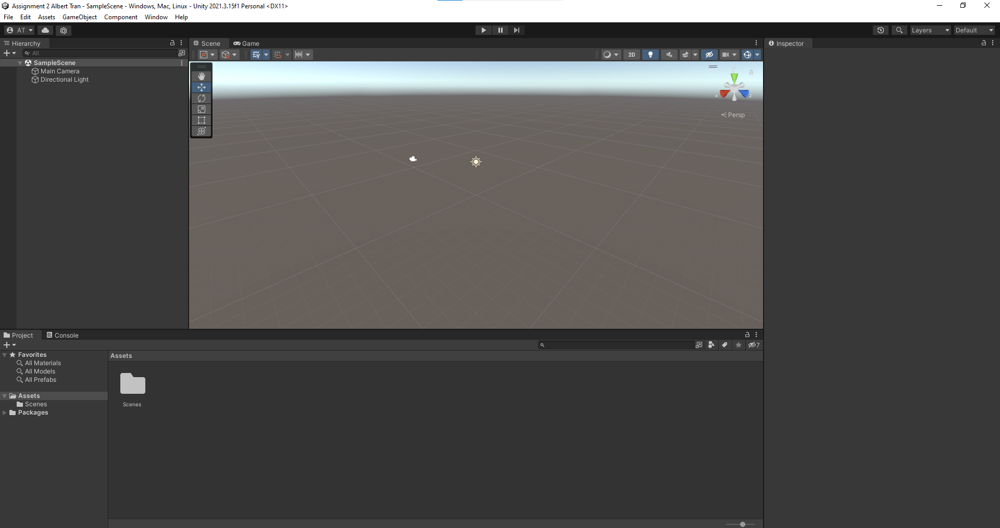
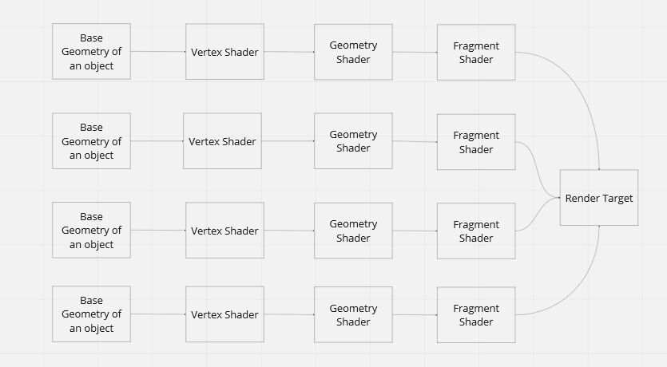
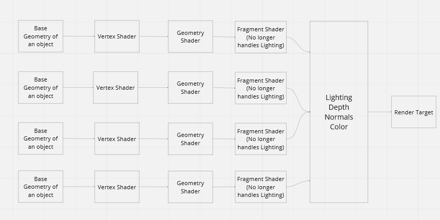
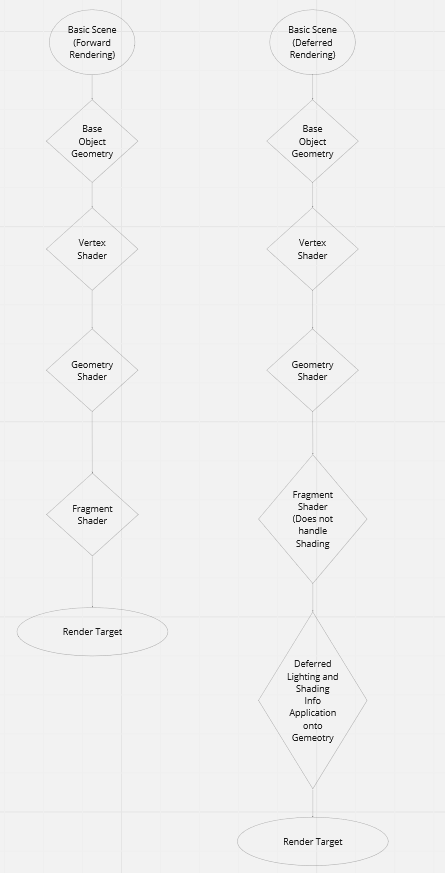
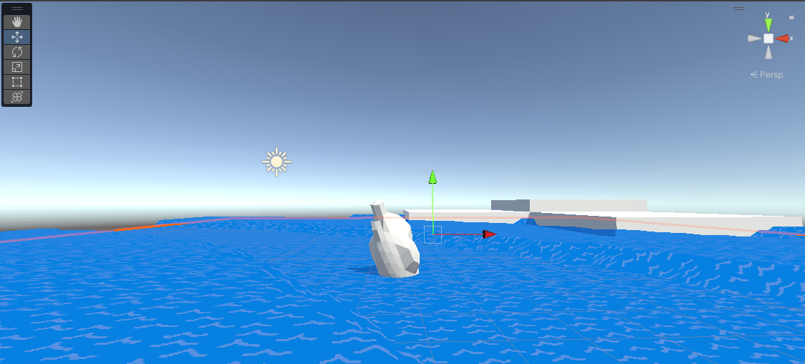

# Assignment 2 In Class Albert Tran
 Assignment 2 in class activity for Internediate Computer Graphics 

#Deffered and Forward rendering: What's the difference and implementation

Within the field of Computer Graphics there are typically two different kinds of rendering pipelines we can use Forward Rendering and Deffered Rendering.

Forward rendering consists of 4 main parts, The base geometry of a shape, the vertex shader, the geometry shader, and the fragment shader. Essentially this is the basic rendering technique most engines use, the vertex shader providing vertex information and transformations such as rotation, translation, or scaling, The Geometry shader can then take this information and change the geometry of the object itself, as the name implies. Finally the fragment shader adds color and lighting to the object, and creates a basic object for use.

The pipeline for this may look like the following:

Deferred Rendering on the other hand uses the same steps as Forward Rendering, going from Vertex to Geometry, and then to Fragment. However it is changed a bit, instead of simplely going through all of the shaders, it instead defers the the shaders until the pipeline has gone through everything. It then also handles the lighting and other shading information by applying it at the end, instead of at the fragment shader. 

The pipeline for this may look like the following:

The reason why you may want to use Deffered Rendering over Forward Rendering may be for a few reasons. The main reason why is that with Forward rendering, since the fragment shader takes in your geometry and vertex information, it can only apply lighting on a per vertex basis, which can result in very intensive calculations if your object has a lot of vertices. Since deffered rendering splits this process, you end not having to do as many calculations, which results in less intensitivity for your object. 

A Flowchart for both pipelines may look like the following:

#Sqaure Waves with Toon Shading

In this part of the assignment we will create sqaure waves and apply toon shading to them:

In order to start with this shader, we first need to create a basic Toon Shading lighting model, which we like this:

This code essentially splits the different tones of our light across a "Ramp" Texture, which will apply toon shading to the object, for a more in depth explination, essentially what we do here is that we will bind different tones of the shading of our object to a texture, essentially going from one tone to another, this differs from traditional or standard shading, as that blends shades together.

This is then followed by the part of the code which applies the sqaure waves:

This code essentially displaces our vertex by taking the square root of the different vertex coordinates and adding them to an offset. I also added the `_Time variable`, this variable will move our "waves" across the mesh. One more thing we need to do for square waves is to give our mesh more faces, as a simple plane does not have enough in order to create the sqaure waves we want, since we're doing these waves on a per vertex basis. This also differs from the waves we did in the tutorial by applying them into a surface shader.

(Shown above is the mesh of my plane)

This portion of the assignment is able to be viewed in my "Release For Base Scene" Release. The final scene looks like this:

